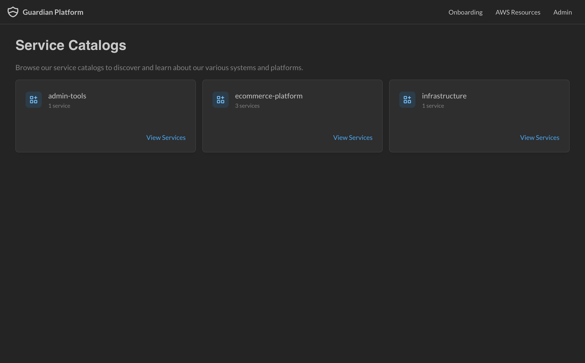
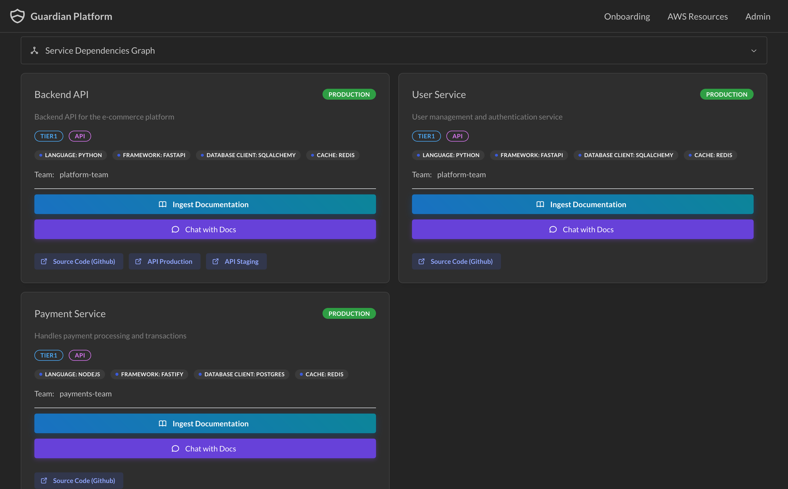
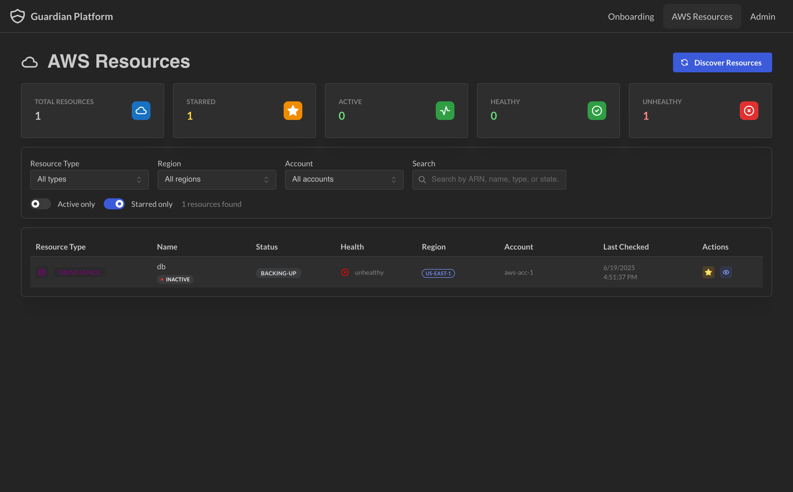
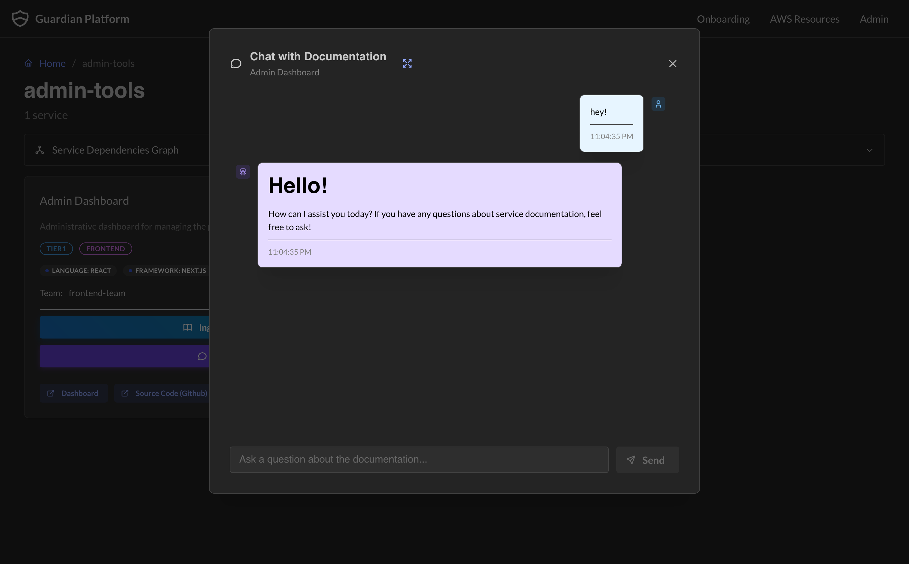
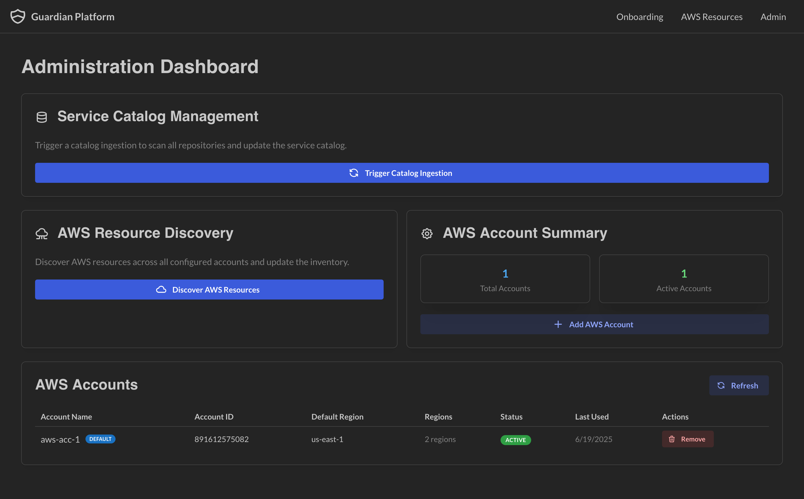

# 🛡️ Guardian Platform

<p align="center">
  
</p>

<p align="center">
  <strong>A comprehensive infrastructure and service discovery platform that provides centralized visibility into your organization's services and cloud resources.</strong>
</p>

<p align="center">
  <a href="#-quick-setup">🚀 Quick Start</a> •
  <a href="docs/README.md">📖 Setup Guide</a> •
  <a href="#-core-features">✨ Features</a> •
  <a href="#-tech-stack">🔧 Tech Stack</a>
</p>


## ✨ Core Features

<table>
<tr>
<td width="50%">

### 🔍 Service Discovery
Automatically catalog services through owner-defined YAML manifests with comprehensive metadata tracking.



</td>
<td width="50%">

### ☁️ AWS Resource Discovery  
Automated discovery and tracking of cloud infrastructure across multiple AWS accounts.



</td>
</tr>
<tr>
<td width="50%">

### 💬 Documentation Chat
AI-powered conversations with service documentation using LlamaIndex for intelligent retrieval.



</td>
<td width="50%">

### 📊 Admin Dashboard
Centralized control panel for managing the platform, users, and system configuration.



</td>
</tr>
</table>

**Additional Features:**
- 🔗 **Dependency Visualization** - Interactive graphs showing service relationships
- 📈 **Operational Awareness** - Service lifecycle, ownership, and health tracking
- ⭐ **Resource Starring** - Favorite and filter important infrastructure components
- 🔒 **Multi-Account Support** - Secure credential management with AES-256 encryption

This foundation supports better operational decision-making and establishes the groundwork for comprehensive service readiness management.

## 📝 Service Discovery Setup

Guardian automatically discovers services through owner-defined YAML manifests in your repositories. Here's how to get started:

### 1. Create the `.guardian` Folder
In your repository root, create a `.guardian` folder:
```bash
mkdir .guardian
```

### 2. Create Service Manifests
Add YAML files named after your services (e.g., `my-service.yml`):

```yaml
kind: Service
metadata:
  name: node-service              # Required: Unique service identifier
  displayName: "Node Service"     # Optional: Human-readable name
  description: "Manages request routing to appropriate services"

spec:
  owner:
    team: platform-team           # Required: Owning team
    email: team@company.com       # Optional: Contact email
  
  lifecycle: production           # Required: development|beta|production|deprecated|retired
  tier: tier1                    # Optional: tier1 (critical) to tier4 (low priority)
  type: api                      # Optional: api|frontend|worker|cronjob|database|library
  partOf: user-platform          # Optional: Larger system this service belongs to
  
  techStack:                     # Optional: Technologies used
    - "Language: Node.js"
    - "Framework: Fastify"
    - "Database: PostgreSQL"
  
  links:                         # Optional: Important service URLs
    - name: "Source Code"
      url: "https://github.com/org/service"
    - name: "API Documentation"
      url: "https://api.company.com/docs"
    - name: "Dashboard"
      url: "https://grafana.company.com/service-dashboard"
```

### 3. Repository Structure
```
your-repo/
├── .guardian/
│   ├── api-service.yml
│   ├── worker-service.yml
│   └── frontend-app.yml
├── src/
└── ...
```

### 4. Automatic Discovery
Guardian will:
- Periodically scan repositories for `.guardian` folders
- Catalog services and their metadata
- Build dependency relationships
- Enable chat with service documentation

> 📖 **Need more details?** Visit `/onboarding` in your Guardian instance for the complete setup guide with examples.

## 🔧 Tech Stack

<table>
<tr>
<td>

**🎨 Frontend**
- Next.js 15 with App Router
- Mantine UI Components

</td>
<td>

**🗄️ Backend & Database**
- PostgreSQL with pgvector
- Drizzle ORM

</td>
</tr>
<tr>
<td>

**🤖 AI & Search**
- LlamaIndex Cloud
- pgvector similarity search
- OpenAI Integration

</td>
<td>

**☁️ Infrastructure**
- Docker & Docker Compose
- AWS SDK Integration
- GitHub API Integration

</td>
</tr>
</table>

## 🚀 Quick Setup

### 💻 Local Development

```bash
# 1. Clone and navigate
git clone <repository-url>
cd guardian-nextjs

# 2. Environment setup
cp .env.example .env.local
# Fill in required variables (see below)

# 3. Database setup
npm run db:migrate

# 4. Install and run
npm install
npm run dev
```

**Required Environment Variables:**
- `DATABASE_URL` - PostgreSQL connection string
- `GITHUB_APP_*` - GitHub App credentials ([setup guide](docs/README.md))
- `AWS_CREDENTIALS_ENCRYPTION_KEY` - Generate with `openssl rand -base64 32`
- `LLAMA_API_KEY` - LlamaIndex Cloud API key
- `LLM_API_KEY` - OpenAI or LLM provider API key

### 🐳 Docker Compose

```bash
docker compose up --build
```

Includes PostgreSQL with pgvector and handles environment variables from `.env.local`.

### 📋 Prerequisites
- Node.js 20+
- PostgreSQL with pgvector extension
- GitHub App with repository read permissions
- AWS IAM credentials (read-only)

> 📖 **Need help?** Check out the [detailed setup guide](docs/README.md) for GitHub App creation, AWS configuration, and troubleshooting.


## Todo

- [ ] Log handler
- [X] Handle multiple AWS accounts
- [ ] Move to tanstack query and tanstack table
- [ ] Deployment checklist automation
- [ ] Authentication setup (org level)
- [ ] Monitoring from the given url (if in the service)
